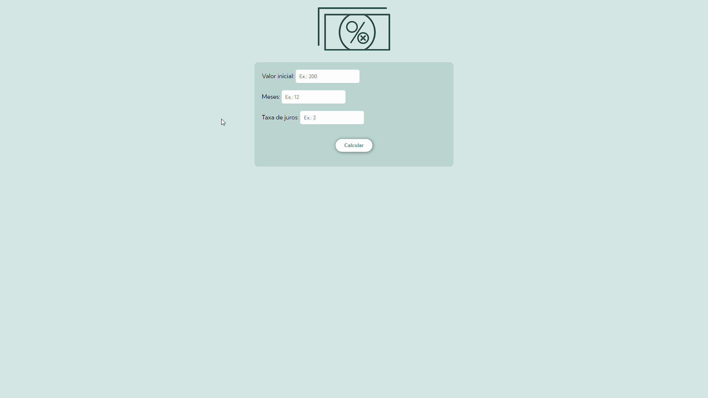

# calculo-juros-composto
Este programa tem a função de calcular juros compostos a partir da entrada do usuário de: um valor inicial, uma taxa em porcentagem e a quantidade de meses sobre os quais os juros serão calculados.

